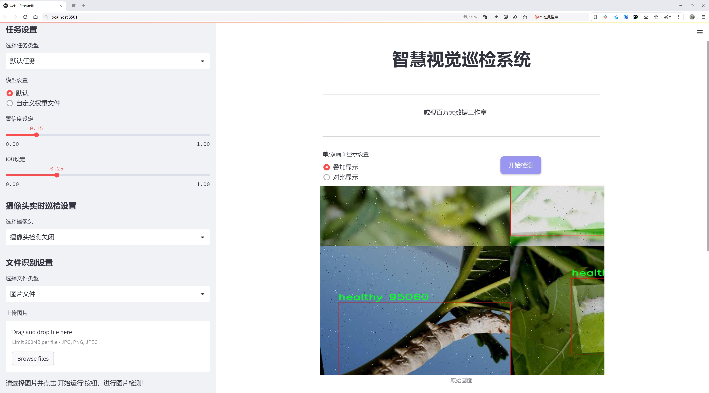
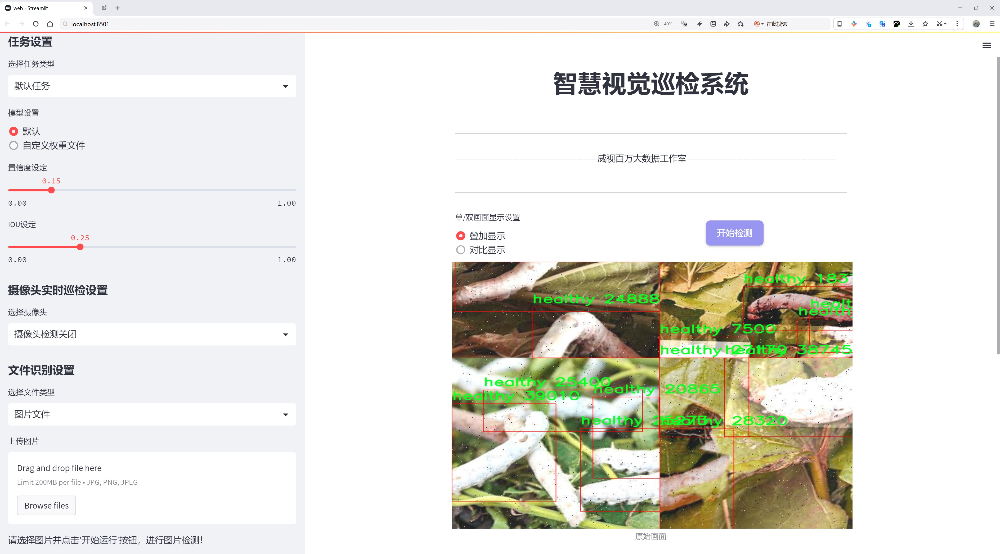
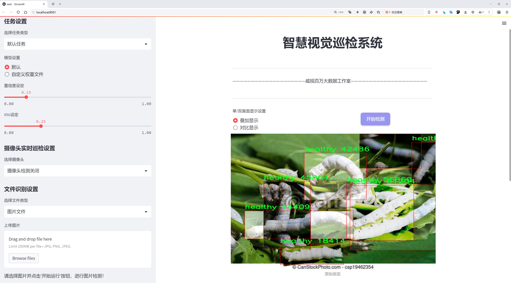
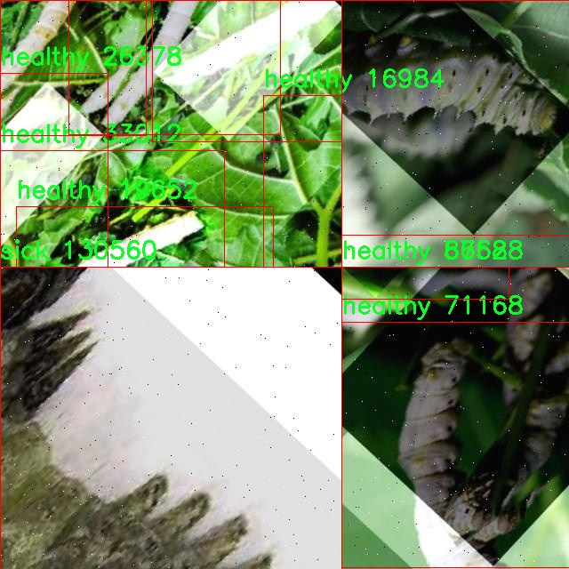
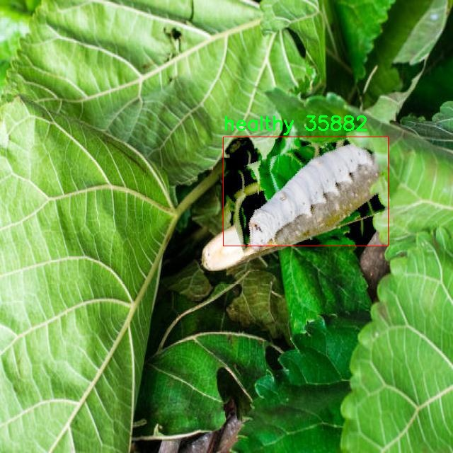
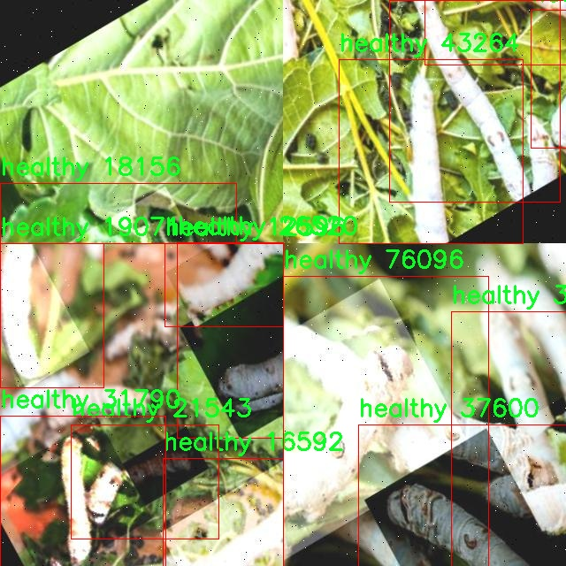
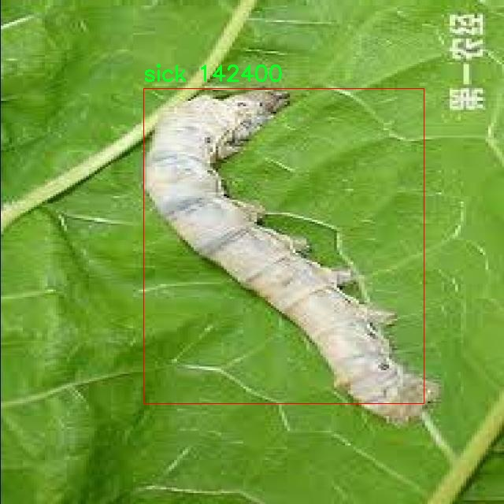
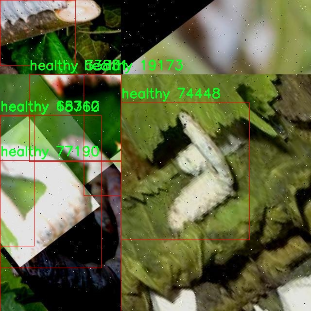

# 蚕病检测检测系统源码分享
 # [一条龙教学YOLOV8标注好的数据集一键训练_70+全套改进创新点发刊_Web前端展示]

### 1.研究背景与意义

项目参考[AAAI Association for the Advancement of Artificial Intelligence](https://gitee.com/qunmasj/projects)

项目来源[AACV Association for the Advancement of Computer Vision](https://kdocs.cn/l/cszuIiCKVNis)

研究背景与意义

随着全球人口的不断增长，农业生产面临着日益严峻的挑战，尤其是在蚕丝生产领域。蚕病的发生不仅影响了蚕的生长和发育，还直接关系到丝绸产业的经济效益和可持续发展。因此，及时、准确地检测蚕病成为了提高蚕丝生产效率的重要环节。传统的蚕病检测方法主要依赖于人工观察和经验判断，这种方法不仅耗时耗力，而且容易受到主观因素的影响，导致检测结果的准确性和一致性不足。为了解决这一问题，基于计算机视觉和深度学习技术的自动化检测系统应运而生。

近年来，YOLO（You Only Look Once）系列目标检测算法因其高效性和准确性在各类视觉任务中得到了广泛应用。YOLOv8作为该系列的最新版本，结合了更为先进的网络结构和训练策略，能够在保证检测精度的同时显著提高检测速度。然而，针对特定领域的应用，如蚕病检测，现有的YOLOv8模型仍需进行一定的改进和优化，以适应特定的数据集和检测需求。本研究旨在基于改进的YOLOv8模型，构建一个高效的蚕病检测系统，以实现对健康和病态蚕的快速、准确识别。

本研究所使用的数据集包含3700张图像，涵盖了健康和病态两类蚕的样本。这一数据集的构建为模型的训练和验证提供了丰富的基础。通过对这两类图像的深入分析，研究将探索不同蚕病的特征表现，并通过改进YOLOv8模型的特征提取和分类能力，提升其在蚕病检测中的应用效果。此外，研究还将关注数据增强技术的应用，以提高模型的泛化能力和鲁棒性，确保其在实际应用中的有效性。

本研究的意义不仅在于提升蚕病检测的效率和准确性，更在于推动智能农业的发展。通过将深度学习技术与传统农业相结合，能够为蚕丝生产提供更为科学和高效的管理手段，降低生产成本，提高经济效益。同时，研究成果还可为其他农业病害的检测提供借鉴，推动计算机视觉技术在农业领域的广泛应用。

综上所述，基于改进YOLOv8的蚕病检测系统的研究具有重要的理论价值和实际意义。它不仅为蚕丝产业的可持续发展提供了技术支持，也为智能农业的未来发展开辟了新的方向。通过深入研究和应用这一技术，期望能够为农业生产带来革命性的变化，助力实现农业现代化和智能化的目标。

### 2.图片演示







##### 注意：由于此博客编辑较早，上面“2.图片演示”和“3.视频演示”展示的系统图片或者视频可能为老版本，新版本在老版本的基础上升级如下：（实际效果以升级的新版本为准）

  （1）适配了YOLOV8的“目标检测”模型和“实例分割”模型，通过加载相应的权重（.pt）文件即可自适应加载模型。

  （2）支持“图片识别”、“视频识别”、“摄像头实时识别”三种识别模式。

  （3）支持“图片识别”、“视频识别”、“摄像头实时识别”三种识别结果保存导出，解决手动导出（容易卡顿出现爆内存）存在的问题，识别完自动保存结果并导出到tempDir中。

  （4）支持Web前端系统中的标题、背景图等自定义修改，后面提供修改教程。

  另外本项目提供训练的数据集和训练教程,暂不提供权重文件（best.pt）,需要您按照教程进行训练后实现图片演示和Web前端界面演示的效果。

### 3.视频演示

[3.1 视频演示](https://www.bilibili.com/video/BV1pcsYemEJb/)

### 4.数据集信息展示

##### 4.1 本项目数据集详细数据（类别数＆类别名）

nc: 2
names: ['healthy', 'sick']


##### 4.2 本项目数据集信息介绍

数据集信息展示

在本研究中，我们使用了名为“Sericulture”的数据集，以支持改进YOLOv8的蚕病检测系统的训练和验证。该数据集专注于蚕的健康状况评估，具体包含两大类别：健康（healthy）和生病（sick）。通过对这两类样本的深入分析和处理，我们旨在提升模型在实际应用中的准确性和可靠性。

“Sericulture”数据集的构建过程经过了严格的筛选和标注，确保每一张图像都能够真实反映蚕的健康状态。健康类别的样本包含了生长良好、外观正常的蚕，图像中蚕体色泽鲜亮，形态完整，表现出活跃的生长状态。相对而言，生病类别的样本则展示了蚕在遭受病害时的各种症状，包括但不限于体色暗淡、形态畸形、活动能力下降等。这种清晰的分类为模型的训练提供了丰富的正负样本，使得YOLOv8能够更好地学习到健康与生病蚕之间的显著特征。

在数据集的规模方面，“Sericulture”包含了大量的图像数据，涵盖了不同生长阶段和环境条件下的蚕。这种多样性不仅增强了模型的泛化能力，也使得其在面对实际应用时能够更好地适应不同的场景。数据集中的图像均经过高质量的采集和处理，确保了图像的清晰度和细节的完整性，从而为模型的训练提供了坚实的基础。

为了提高模型的训练效果，我们还对数据集进行了数据增强处理，包括旋转、缩放、裁剪等操作。这些技术手段不仅增加了样本的多样性，还有效地防止了模型的过拟合现象，使得YOLOv8在训练过程中能够学习到更为鲁棒的特征表示。此外，数据集的标注工作也遵循了严格的标准，确保每一张图像的标签准确无误，这对于后续的模型评估和性能验证至关重要。

在模型训练过程中，我们将“Sericulture”数据集分为训练集和验证集，以便于对模型的性能进行客观评估。训练集用于模型的学习，而验证集则用于实时监测模型在未见样本上的表现。通过这种方式，我们能够及时调整模型的参数和结构，以实现最佳的检测效果。

综上所述，“Sericulture”数据集为改进YOLOv8的蚕病检测系统提供了丰富而高质量的训练素材。通过对健康和生病蚕的精确分类与标注，该数据集不仅为模型的训练奠定了坚实的基础，也为未来在蚕业生产中的实际应用提供了重要的支持。随着研究的深入，我们期待通过这一数据集的有效利用，推动蚕病检测技术的进一步发展，助力蚕业的可持续发展与健康管理。











### 5.全套项目环境部署视频教程（零基础手把手教学）

[5.1 环境部署教程链接（零基础手把手教学）](https://www.ixigua.com/7404473917358506534?logTag=c807d0cbc21c0ef59de5)


[5.2 安装Python虚拟环境创建和依赖库安装视频教程链接（零基础手把手教学）](https://www.ixigua.com/7404474678003106304?logTag=1f1041108cd1f708b01a)

### 6.手把手YOLOV8训练视频教程（零基础小白有手就能学会）

[6.1 手把手YOLOV8训练视频教程（零基础小白有手就能学会）](https://www.ixigua.com/7404477157818401292?logTag=d31a2dfd1983c9668658)

### 7.70+种全套YOLOV8创新点代码加载调参视频教程（一键加载写好的改进模型的配置文件）

[7.1 70+种全套YOLOV8创新点代码加载调参视频教程（一键加载写好的改进模型的配置文件）](https://www.ixigua.com/7404478314661806627?logTag=29066f8288e3f4eea3a4)

### 8.70+种全套YOLOV8创新点原理讲解（非科班也可以轻松写刊发刊，V10版本正在科研待更新）

由于篇幅限制，每个创新点的具体原理讲解就不一一展开，具体见下列网址中的创新点对应子项目的技术原理博客网址【Blog】：


[8.1 70+种全套YOLOV8创新点原理讲解链接](https://gitee.com/qunmasj/good)

### 9.系统功能展示（检测对象为举例，实际内容以本项目数据集为准）

图9.1.系统支持检测结果表格显示

  图9.2.系统支持置信度和IOU阈值手动调节

  图9.3.系统支持自定义加载权重文件best.pt(需要你通过步骤5中训练获得)

  图9.4.系统支持摄像头实时识别

  图9.5.系统支持图片识别

  图9.6.系统支持视频识别

  图9.7.系统支持识别结果文件自动保存

  图9.8.系统支持Excel导出检测结果数据


### 10.原始YOLOV8算法原理

原始YOLOv8算法原理

YOLOv8算法作为YOLO系列的最新成员，承载着目标检测领域的诸多创新与改进。其设计理念依然遵循了YOLO系列一贯的高效性与准确性，结合了YOLOv5和YOLOv7的优点，进一步提升了性能和灵活性。YOLOv8的网络结构主要由输入层、主干网络、特征融合层和解耦头组成，整体架构在保持轻量化的同时，显著提高了检测精度。

在主干网络部分，YOLOv8延续了YOLOv5的CSPDarknet设计思路，但对其进行了重要的结构调整。具体而言，YOLOv8将YOLOv5中的C3模块替换为C2f模块。C2f模块的设计灵感来源于YOLOv7的ELAN模块，其通过引入更多的梯度流分支来增强特征提取能力。这种设计不仅提升了网络的学习能力，还有效缓解了深层网络中的梯度消失问题。C2f模块的结构由多个CBS（卷积+归一化+SiLU激活）模块和若干Bottleneck模块组成，通过分支的方式实现特征的并行处理，从而获得更加丰富的特征信息。值得注意的是，C2f模块在保持输入输出通道一致的前提下，通过控制梯度路径的长度，使得网络能够提取更多的隐藏特征，解决了模型加深后收敛性下降的问题。

在特征融合层，YOLOv8采用了PAN-FPN（Path Aggregation Network - Feature Pyramid Network）结构，以实现多尺度特征的有效融合。与YOLOv5不同，YOLOv8在上采样阶段去除了1x1卷积层，直接将高层特征进行上采样并与中层特征进行拼接。这种简化的结构使得特征融合更加高效，能够更好地保留不同层次的语义信息，从而提高目标检测的准确性。特征融合后，网络输出的特征图将被送入解耦头进行后续的分类和回归任务。

YOLOv8的解耦头是其最大的创新之一。与以往的耦合头不同，YOLOv8的解耦头将分类和回归任务分开处理，分别通过不同的卷积层进行特征提取。这种设计使得网络在处理目标检测时更加灵活，能够更好地适应不同类型的目标。解耦头的输出包括三个不同尺度的特征图，分别对应于80x80、40x40和20x20的分辨率。每个特征图通过Softmax和卷积计算，最终生成目标的边界框和类别信息。

YOLOv8在损失函数的设计上也进行了重要的改进。其采用了VFLLoss作为分类损失，并结合DFLLoss和CIoULoss作为回归损失。通过这种方式，YOLOv8能够更好地处理样本不平衡问题，尤其是在目标较小或样本稀缺的情况下，提升了模型的学习效率。此外，YOLOv8还引入了Task-Aligned的样本匹配策略，替代了传统的静态匹配方法，使得训练过程更加灵活和高效。

在数据预处理方面，YOLOv8继续采用YOLOv5的策略，包括马赛克增强、混合增强、空间扰动和颜色扰动等多种增强手段。这些数据增强技术能够有效提升模型的泛化能力，使其在不同场景下的表现更加稳健。

总体而言，YOLOv8算法通过对网络结构的优化、特征融合的改进以及损失函数的创新，展现了在目标检测领域的强大潜力。其Anchor-Free的设计理念，摒弃了传统的锚框方法，使得目标检测过程更加简洁高效。YOLOv8不仅在精度上有所提升，还在计算效率上表现出色，适用于各种实际应用场景，成为目标检测任务中的一个重要工具。随着YOLOv8的推广与应用，未来的目标检测研究将迎来更多的可能性与挑战。


### 11.项目核心源码讲解（再也不用担心看不懂代码逻辑）

#### 11.1 ui.py

以下是对给定代码的核心部分进行提炼和详细注释的版本：

```python
import sys
import subprocess

def run_script(script_path):
    """
    使用当前 Python 环境运行指定的脚本。

    Args:
        script_path (str): 要运行的脚本路径

    Returns:
        None
    """
    # 获取当前 Python 解释器的路径
    python_path = sys.executable

    # 构建运行命令，使用 streamlit 运行指定的脚本
    command = f'"{python_path}" -m streamlit run "{script_path}"'

    # 执行命令，并等待其完成
    result = subprocess.run(command, shell=True)
    
    # 检查命令执行的返回码，如果不为0，表示执行出错
    if result.returncode != 0:
        print("脚本运行出错。")

# 主程序入口
if __name__ == "__main__":
    # 指定要运行的脚本路径
    script_path = "web.py"  # 假设脚本在当前目录下

    # 调用函数运行指定的脚本
    run_script(script_path)
```

### 代码核心部分分析：

1. **导入模块**：
   - `sys`：用于获取当前 Python 解释器的路径。
   - `subprocess`：用于执行外部命令。

2. **`run_script` 函数**：
   - **参数**：接收一个字符串参数 `script_path`，表示要运行的 Python 脚本的路径。
   - **功能**：构建并执行一个命令来运行指定的脚本，使用 `streamlit` 模块。
   - **返回值**：无返回值，直接在控制台输出错误信息。

3. **主程序入口**：
   - 使用 `if __name__ == "__main__":` 来确保代码仅在直接运行时执行。
   - 指定要运行的脚本路径（这里假设为 `web.py`）。
   - 调用 `run_script` 函数来执行脚本。

### 注释说明：
- 代码中的注释详细解释了每一步的目的和功能，便于理解代码的整体逻辑和运行流程。

这个文件名为 `ui.py`，其主要功能是通过当前的 Python 环境来运行一个指定的脚本，具体来说是一个名为 `web.py` 的脚本。文件中首先导入了必要的模块，包括 `sys`、`os` 和 `subprocess`，这些模块分别用于访问系统参数、操作系统功能和执行外部命令。

在 `run_script` 函数中，首先获取当前 Python 解释器的路径，这样可以确保使用正确的 Python 环境来运行脚本。接着，构建一个命令字符串，这个命令会调用 `streamlit` 模块来运行指定的脚本。`streamlit` 是一个用于构建数据应用的库，通常用于快速创建交互式的网页应用。

然后，使用 `subprocess.run` 方法来执行这个命令。这个方法会在一个新的进程中运行命令，并等待其完成。如果脚本运行过程中出现错误，返回的状态码会不等于零，此时会打印出“脚本运行出错”的提示信息。

在文件的最后部分，使用 `if __name__ == "__main__":` 语句来确保只有在直接运行这个文件时才会执行后面的代码。在这里，首先通过 `abs_path` 函数指定了要运行的脚本路径 `web.py`，然后调用 `run_script` 函数来执行这个脚本。

总体来说，这个文件的作用是提供一个简单的接口，通过它可以方便地启动一个基于 `streamlit` 的网页应用。

#### 11.2 70+种YOLOv8算法改进源码大全和调试加载训练教程（非必要）\ultralytics\models\sam\model.py

以下是代码中最核心的部分，并附上详细的中文注释：

```python
from pathlib import Path  # 导入Path类，用于处理文件路径

from ultralytics.engine.model import Model  # 从Ultralytics引擎导入Model基类
from ultralytics.utils.torch_utils import model_info  # 导入用于获取模型信息的工具

from .build import build_sam  # 导入构建SAM模型的函数
from .predict import Predictor  # 导入预测器类


class SAM(Model):
    """
    SAM（Segment Anything Model）接口类。

    SAM旨在进行可提示的实时图像分割。可以使用多种提示方式，如边界框、点或标签。
    该模型具有零-shot性能，并在SA-1B数据集上进行训练。
    """

    def __init__(self, model='sam_b.pt') -> None:
        """
        使用预训练模型文件初始化SAM模型。

        参数：
            model (str): 预训练SAM模型文件的路径。文件应具有.pt或.pth扩展名。

        异常：
            NotImplementedError: 如果模型文件扩展名不是.pt或.pth。
        """
        # 检查模型文件扩展名是否有效
        if model and Path(model).suffix not in ('.pt', '.pth'):
            raise NotImplementedError('SAM预测需要预训练的*.pt或*.pth模型。')
        super().__init__(model=model, task='segment')  # 调用父类构造函数，初始化模型和任务

    def predict(self, source, stream=False, bboxes=None, points=None, labels=None, **kwargs):
        """
        对给定的图像或视频源执行分割预测。

        参数：
            source (str): 图像或视频文件的路径，或PIL.Image对象，或numpy.ndarray对象。
            stream (bool, optional): 如果为True，则启用实时流。默认为False。
            bboxes (list, optional): 提示分割的边界框坐标列表。默认为None。
            points (list, optional): 提示分割的点列表。默认为None。
            labels (list, optional): 提示分割的标签列表。默认为None。

        返回：
            (list): 模型的预测结果。
        """
        # 设置预测的默认参数
        overrides = dict(conf=0.25, task='segment', mode='predict', imgsz=1024)
        kwargs.update(overrides)  # 更新额外参数
        prompts = dict(bboxes=bboxes, points=points, labels=labels)  # 将提示信息打包
        return super().predict(source, stream, prompts=prompts, **kwargs)  # 调用父类的预测方法

    def __call__(self, source=None, stream=False, bboxes=None, points=None, labels=None, **kwargs):
        """
        'predict'方法的别名。

        参数：
            source (str): 图像或视频文件的路径，或PIL.Image对象，或numpy.ndarray对象。
            stream (bool, optional): 如果为True，则启用实时流。默认为False。
            bboxes (list, optional): 提示分割的边界框坐标列表。默认为None。
            points (list, optional): 提示分割的点列表。默认为None。
            labels (list, optional): 提示分割的标签列表。默认为None。

        返回：
            (list): 模型的预测结果。
        """
        return self.predict(source, stream, bboxes, points, labels, **kwargs)  # 调用预测方法

    def info(self, detailed=False, verbose=True):
        """
        记录有关SAM模型的信息。

        参数：
            detailed (bool, optional): 如果为True，则显示有关模型的详细信息。默认为False。
            verbose (bool, optional): 如果为True，则在控制台上显示信息。默认为True。

        返回：
            (tuple): 包含模型信息的元组。
        """
        return model_info(self.model, detailed=detailed, verbose=verbose)  # 获取模型信息

    @property
    def task_map(self):
        """
        提供从'segment'任务到其对应'预测器'的映射。

        返回：
            (dict): 将'segment'任务映射到其对应'预测器'的字典。
        """
        return {'segment': {'predictor': Predictor}}  # 返回任务与预测器的映射关系
```

### 代码核心部分说明：
1. **类定义**：`SAM`类继承自`Model`，用于实现图像分割的功能。
2. **初始化方法**：构造函数中检查模型文件的扩展名，确保其为`.pt`或`.pth`，并调用父类的构造函数进行初始化。
3. **预测方法**：`predict`方法用于对输入的图像或视频进行分割预测，支持多种提示方式（边界框、点、标签）。
4. **信息获取**：`info`方法用于获取模型的详细信息。
5. **任务映射**：`task_map`属性提供了任务与对应预测器的映射关系。

这个程序文件是Ultralytics YOLO项目中的一个模块，主要实现了SAM（Segment Anything Model）模型的接口。SAM模型旨在进行实时图像分割任务，具有高度的灵活性和适应性。它可以通过不同的提示（如边界框、点或标签）进行分割，并且具备零-shot性能，能够在没有先前知识的情况下适应新的图像分布和任务。该模型是基于SA-1B数据集进行训练的。

文件中首先导入了一些必要的库和模块，包括路径处理的Path类、模型基类Model、模型信息获取的model_info函数，以及构建和预测SAM模型所需的build_sam和Predictor模块。

SAM类继承自Model类，构造函数__init__接受一个参数model，表示预训练模型文件的路径。它会检查文件扩展名是否为.pt或.pth，如果不是，则抛出NotImplementedError异常。初始化时会调用父类的构造函数，并指定任务为“segment”。

_load方法用于加载指定的权重文件到SAM模型中，weights参数为权重文件的路径，task参数可选。

predict方法是该类的核心功能之一，接受图像或视频源进行分割预测。它支持实时流处理，并可以通过bboxes、points和labels参数提供提示信息。方法内部会设置一些默认参数，并调用父类的predict方法进行实际的预测。

__call__方法是predict方法的别名，提供了相同的功能，允许用户以更直观的方式调用模型。

info方法用于记录和返回SAM模型的信息，支持详细和简洁两种信息展示方式。

最后，task_map属性提供了一个字典，将“segment”任务映射到其对应的Predictor类，方便后续的任务处理。

整体来看，这个模块为使用SAM模型进行图像分割提供了清晰的接口和功能，适合需要实时分割的应用场景。

#### 11.3 code\ultralytics\models\fastsam\prompt.py

以下是经过简化和注释的核心代码部分，保留了主要功能和逻辑：

```python
import os
import numpy as np
import torch
from PIL import Image
import cv2
from ultralytics.utils import TQDM

class FastSAMPrompt:
    """
    Fast Segment Anything Model类，用于图像注释和可视化。
    """

    def __init__(self, source, results, device="cuda") -> None:
        """初始化FastSAMPrompt，设置源图像、结果和计算设备。"""
        self.device = device
        self.results = results
        self.source = source

        # 导入CLIP模型
        try:
            import clip
        except ImportError:
            from ultralytics.utils.checks import check_requirements
            check_requirements("git+https://github.com/openai/CLIP.git")
            import clip
        self.clip = clip

    @staticmethod
    def _segment_image(image, bbox):
        """根据提供的边界框坐标对图像进行分割。"""
        image_array = np.array(image)
        segmented_image_array = np.zeros_like(image_array)
        x1, y1, x2, y2 = bbox
        segmented_image_array[y1:y2, x1:x2] = image_array[y1:y2, x1:x2]
        segmented_image = Image.fromarray(segmented_image_array)
        black_image = Image.new("RGB", image.size, (255, 255, 255))
        transparency_mask = np.zeros((image_array.shape[0], image_array.shape[1]), dtype=np.uint8)
        transparency_mask[y1:y2, x1:x2] = 255
        transparency_mask_image = Image.fromarray(transparency_mask, mode="L")
        black_image.paste(segmented_image, mask=transparency_mask_image)
        return black_image

    @staticmethod
    def _format_results(result, filter=0):
        """将检测结果格式化为包含ID、分割、边界框、得分和面积的注释列表。"""
        annotations = []
        n = len(result.masks.data) if result.masks is not None else 0
        for i in range(n):
            mask = result.masks.data[i] == 1.0
            if torch.sum(mask) >= filter:
                annotation = {
                    "id": i,
                    "segmentation": mask.cpu().numpy(),
                    "bbox": result.boxes.data[i],
                    "score": result.boxes.conf[i],
                }
                annotation["area"] = annotation["segmentation"].sum()
                annotations.append(annotation)
        return annotations

    def plot(self, annotations, output):
        """
        在图像上绘制注释、边界框和点，并保存输出。
        """
        pbar = TQDM(annotations, total=len(annotations))
        for ann in pbar:
            result_name = os.path.basename(ann.path)
            image = ann.orig_img[..., ::-1]  # BGR转RGB
            plt.figure(figsize=(image.shape[1] / 100, image.shape[0] / 100))
            plt.imshow(image)

            if ann.masks is not None:
                masks = ann.masks.data
                for mask in masks:
                    mask = mask.astype(np.uint8)
                    plt.imshow(mask, alpha=0.5)  # 以半透明方式显示掩膜

            # 保存图像
            save_path = os.path.join(output, result_name)
            plt.axis("off")
            plt.savefig(save_path, bbox_inches="tight", pad_inches=0, transparent=True)
            plt.close()
            pbar.set_description(f"Saving {result_name} to {save_path}")

    @torch.no_grad()
    def retrieve(self, model, preprocess, elements, search_text: str) -> int:
        """处理图像和文本，计算相似度并返回softmax分数。"""
        preprocessed_images = [preprocess(image).to(self.device) for image in elements]
        tokenized_text = self.clip.tokenize([search_text]).to(self.device)
        stacked_images = torch.stack(preprocessed_images)
        image_features = model.encode_image(stacked_images)
        text_features = model.encode_text(tokenized_text)
        image_features /= image_features.norm(dim=-1, keepdim=True)
        text_features /= text_features.norm(dim=-1, keepdim=True)
        probs = 100.0 * image_features @ text_features.T
        return probs[:, 0].softmax(dim=0)

    def everything_prompt(self):
        """返回类中处理后的结果。"""
        return self.results
```

### 代码注释说明：
1. **类的定义**：`FastSAMPrompt`类用于处理图像分割和注释。
2. **初始化方法**：在初始化时，设置设备、源图像和结果，并导入CLIP模型。
3. **图像分割**：`_segment_image`方法根据给定的边界框对图像进行分割，返回分割后的图像。
4. **结果格式化**：`_format_results`方法将检测结果格式化为注释列表，包含分割掩膜、边界框和得分。
5. **绘图方法**：`plot`方法在图像上绘制注释和掩膜，并保存结果。
6. **检索方法**：`retrieve`方法处理图像和文本，计算相似度并返回softmax分数。
7. **获取结果**：`everything_prompt`方法返回处理后的结果。 

通过这些注释，可以更好地理解代码的功能和结构。

这个程序文件定义了一个名为 `FastSAMPrompt` 的类，主要用于图像注释和可视化，特别是在图像分割和目标检测的上下文中。类的构造函数接收源图像、检测结果和计算设备（如 CUDA 或 CPU），并尝试导入 CLIP 模型以进行线性分配。

类中包含多个静态方法和实例方法。静态方法 `_segment_image` 用于根据给定的边界框对图像进行分割，返回分割后的图像。`_format_results` 方法将检测结果格式化为包含 ID、分割掩码、边界框、置信度分数和面积的注释列表。`_get_bbox_from_mask` 方法则通过对掩码应用形态学变换来获取边界框。

`plot` 方法用于在图像上绘制注释、边界框和点，并将结果保存到指定的输出目录。该方法使用 `TQDM` 进行进度条显示，并通过 Matplotlib 绘制图像和注释。`fast_show_mask` 方法则快速显示掩码注释，支持随机颜色和透明度设置。

`retrieve` 方法使用 CLIP 模型处理图像和文本，计算相似度并返回软最大分数。`_crop_image` 方法根据提供的注释格式裁剪图像，返回裁剪后的图像和相关数据。`box_prompt` 和 `point_prompt` 方法允许用户通过边界框和点的方式修改掩码，并返回更新后的结果。`text_prompt` 方法则处理文本提示，应用于现有结果并返回更新后的结果。

最后，`everything_prompt` 方法返回处理后的结果，方便用户获取最终的分割或检测结果。整个类的设计旨在为图像分割和注释提供灵活且高效的工具，结合了深度学习模型和图像处理技术。

#### 11.4 train.py

以下是经过简化和注释的核心代码部分，主要集中在 YOLO 检测模型的训练过程：

```python
import random
import numpy as np
import torch.nn as nn
from ultralytics.data import build_dataloader, build_yolo_dataset
from ultralytics.engine.trainer import BaseTrainer
from ultralytics.models import yolo
from ultralytics.nn.tasks import DetectionModel
from ultralytics.utils import LOGGER, RANK
from ultralytics.utils.torch_utils import de_parallel, torch_distributed_zero_first

class DetectionTrainer(BaseTrainer):
    """
    扩展自 BaseTrainer 类，用于基于检测模型的训练。
    """

    def build_dataset(self, img_path, mode="train", batch=None):
        """
        构建 YOLO 数据集。

        参数:
            img_path (str): 包含图像的文件夹路径。
            mode (str): 模式为 `train` 或 `val`，用户可以为每种模式自定义不同的增强。
            batch (int, optional): 批次大小，适用于 `rect` 模式。默认为 None。
        """
        gs = max(int(de_parallel(self.model).stride.max() if self.model else 0), 32)  # 获取模型的最大步幅
        return build_yolo_dataset(self.args, img_path, batch, self.data, mode=mode, rect=mode == "val", stride=gs)

    def get_dataloader(self, dataset_path, batch_size=16, rank=0, mode="train"):
        """构造并返回数据加载器。"""
        assert mode in ["train", "val"]  # 确保模式有效
        with torch_distributed_zero_first(rank):  # 仅在 DDP 时初始化数据集 *.cache 一次
            dataset = self.build_dataset(dataset_path, mode, batch_size)  # 构建数据集
        shuffle = mode == "train"  # 训练模式下打乱数据
        workers = self.args.workers if mode == "train" else self.args.workers * 2  # 根据模式设置工作线程数
        return build_dataloader(dataset, batch_size, workers, shuffle, rank)  # 返回数据加载器

    def preprocess_batch(self, batch):
        """对图像批次进行预处理，包括缩放和转换为浮点数。"""
        batch["img"] = batch["img"].to(self.device, non_blocking=True).float() / 255  # 将图像转换为浮点数并归一化
        if self.args.multi_scale:  # 如果启用多尺度
            imgs = batch["img"]
            sz = (
                random.randrange(self.args.imgsz * 0.5, self.args.imgsz * 1.5 + self.stride)
                // self.stride
                * self.stride
            )  # 随机选择图像大小
            sf = sz / max(imgs.shape[2:])  # 计算缩放因子
            if sf != 1:  # 如果需要缩放
                ns = [
                    math.ceil(x * sf / self.stride) * self.stride for x in imgs.shape[2:]
                ]  # 计算新的形状
                imgs = nn.functional.interpolate(imgs, size=ns, mode="bilinear", align_corners=False)  # 进行插值缩放
            batch["img"] = imgs  # 更新批次图像
        return batch

    def get_model(self, cfg=None, weights=None, verbose=True):
        """返回 YOLO 检测模型。"""
        model = DetectionModel(cfg, nc=self.data["nc"], verbose=verbose and RANK == -1)  # 创建检测模型
        if weights:
            model.load(weights)  # 加载权重
        return model

    def plot_training_samples(self, batch, ni):
        """绘制带有注释的训练样本。"""
        plot_images(
            images=batch["img"],
            batch_idx=batch["batch_idx"],
            cls=batch["cls"].squeeze(-1),
            bboxes=batch["bboxes"],
            paths=batch["im_file"],
            fname=self.save_dir / f"train_batch{ni}.jpg",
            on_plot=self.on_plot,
        )

    def plot_metrics(self):
        """从 CSV 文件绘制指标。"""
        plot_results(file=self.csv, on_plot=self.on_plot)  # 保存结果图
```

### 代码说明：
1. **DetectionTrainer 类**：继承自 `BaseTrainer`，用于实现 YOLO 模型的训练过程。
2. **build_dataset 方法**：构建数据集，支持训练和验证模式，并根据需要应用不同的数据增强。
3. **get_dataloader 方法**：创建数据加载器，确保在分布式训练中只初始化一次数据集。
4. **preprocess_batch 方法**：对输入的图像批次进行预处理，包括归一化和可选的多尺度调整。
5. **get_model 方法**：返回一个 YOLO 检测模型，并可选择加载预训练权重。
6. **plot_training_samples 方法**：可视化训练样本及其注释，便于检查数据质量。
7. **plot_metrics 方法**：从 CSV 文件中绘制训练过程中的指标，便于监控训练效果。

这个程序文件 `train.py` 是一个用于训练 YOLO（You Only Look Once）目标检测模型的实现，继承自 `BaseTrainer` 类。文件中主要包含了数据集构建、数据加载、模型设置、训练过程中的损失计算、进度显示以及训练样本和指标的可视化等功能。

首先，程序导入了一些必要的库和模块，包括数学运算、随机数生成、深度学习相关的 PyTorch 模块，以及 Ultralytics 提供的 YOLO 数据处理和模型训练工具。

`DetectionTrainer` 类是该文件的核心，负责构建和训练目标检测模型。它提供了多个方法来实现不同的功能。`build_dataset` 方法用于构建 YOLO 数据集，接收图像路径、模式（训练或验证）和批量大小作为参数。它会根据模型的步幅计算合适的图像尺寸，并调用 `build_yolo_dataset` 函数生成数据集。

`get_dataloader` 方法用于创建数据加载器，确保在分布式训练时只初始化一次数据集，并根据模式设置是否打乱数据。它还根据训练或验证模式调整工作线程的数量。

`preprocess_batch` 方法负责对图像批次进行预处理，包括将图像缩放到适当的大小并转换为浮点数格式。该方法还支持多尺度训练，通过随机选择图像大小来增强模型的鲁棒性。

`set_model_attributes` 方法用于设置模型的属性，包括类别数量和类别名称等，以确保模型能够正确处理输入数据。

`get_model` 方法返回一个 YOLO 检测模型实例，可以选择加载预训练权重。`get_validator` 方法则返回一个用于模型验证的 `DetectionValidator` 实例。

在训练过程中，`label_loss_items` 方法用于返回带有标签的损失字典，方便监控训练过程中的损失变化。`progress_string` 方法生成一个格式化的字符串，显示训练进度，包括当前的轮次、GPU 内存使用情况和损失值等信息。

此外，`plot_training_samples` 方法用于可视化训练样本及其标注，生成包含图像和边界框的图像文件。`plot_metrics` 和 `plot_training_labels` 方法则用于绘制训练过程中的指标和标签，帮助用户分析模型的训练效果。

整体来看，这个文件提供了一个完整的训练框架，涵盖了从数据准备到模型训练和评估的各个方面，适合用于 YOLO 模型的目标检测任务。

#### 11.5 code\ultralytics\data\annotator.py

以下是代码中最核心的部分，并附上详细的中文注释：

```python
from pathlib import Path
from ultralytics import SAM, YOLO

def auto_annotate(data, det_model="yolov8x.pt", sam_model="sam_b.pt", device="", output_dir=None):
    """
    自动标注图像，使用YOLO目标检测模型和SAM分割模型。

    参数:
        data (str): 包含待标注图像的文件夹路径。
        det_model (str, optional): 预训练的YOLO检测模型。默认为'yolov8x.pt'。
        sam_model (str, optional): 预训练的SAM分割模型。默认为'sam_b.pt'。
        device (str, optional): 运行模型的设备。默认为空字符串（使用CPU或可用的GPU）。
        output_dir (str | None | optional): 保存标注结果的目录。
            默认为与'data'相同目录下的'labels'文件夹。

    示例:
        auto_annotate(data='ultralytics/assets', det_model='yolov8n.pt', sam_model='mobile_sam.pt')
    """
    # 加载YOLO目标检测模型
    det_model = YOLO(det_model)
    # 加载SAM分割模型
    sam_model = SAM(sam_model)

    # 将数据路径转换为Path对象
    data = Path(data)
    # 如果未指定输出目录，则创建一个默认的输出目录
    if not output_dir:
        output_dir = data.parent / f"{data.stem}_auto_annotate_labels"
    # 创建输出目录（如果不存在）
    Path(output_dir).mkdir(exist_ok=True, parents=True)

    # 使用YOLO模型对数据进行目标检测，返回检测结果
    det_results = det_model(data, stream=True, device=device)

    # 遍历每个检测结果
    for result in det_results:
        # 获取检测到的类别ID
        class_ids = result.boxes.cls.int().tolist()  # noqa
        # 如果检测到的类别ID不为空
        if len(class_ids):
            # 获取边界框坐标
            boxes = result.boxes.xyxy  # Boxes对象，包含边界框输出
            # 使用SAM模型进行分割，传入边界框
            sam_results = sam_model(result.orig_img, bboxes=boxes, verbose=False, save=False, device=device)
            # 获取分割结果
            segments = sam_results[0].masks.xyn  # noqa

            # 将分割结果写入文本文件
            with open(f"{Path(output_dir) / Path(result.path).stem}.txt", "w") as f:
                for i in range(len(segments)):
                    s = segments[i]
                    # 如果分割结果为空，则跳过
                    if len(s) == 0:
                        continue
                    # 将分割结果转换为字符串并写入文件
                    segment = map(str, segments[i].reshape(-1).tolist())
                    f.write(f"{class_ids[i]} " + " ".join(segment) + "\n")
```

### 代码说明：
1. **模型加载**：使用YOLO和SAM模型进行目标检测和图像分割。
2. **路径处理**：使用`Path`模块处理文件路径，确保输出目录存在。
3. **目标检测**：对输入图像进行目标检测，获取检测结果，包括类别ID和边界框。
4. **图像分割**：根据检测到的边界框，使用SAM模型进行图像分割，获取分割结果。
5. **结果保存**：将每个图像的分割结果和对应的类别ID保存到文本文件中。

这个程序文件是用于自动标注图像的，利用了YOLO（You Only Look Once）目标检测模型和SAM（Segment Anything Model）分割模型。其主要功能是对指定文件夹中的图像进行自动标注，并将结果保存到指定的输出目录。

程序首先导入了必要的库，包括`Path`用于处理文件路径，以及`YOLO`和`SAM`模型。接着定义了一个名为`auto_annotate`的函数，该函数接受多个参数：

- `data`：一个字符串，表示包含待标注图像的文件夹路径。
- `det_model`：一个可选参数，指定预训练的YOLO检测模型，默认值为'yolov8x.pt'。
- `sam_model`：一个可选参数，指定预训练的SAM分割模型，默认值为'sam_b.pt'。
- `device`：一个可选参数，指定运行模型的设备，默认为空字符串（表示使用CPU或可用的GPU）。
- `output_dir`：一个可选参数，指定保存标注结果的目录，默认是在`data`目录下创建一个名为'labels'的文件夹。

在函数内部，首先实例化YOLO和SAM模型。然后将`data`转换为`Path`对象，以便于后续的路径操作。如果没有指定输出目录，则在`data`的父目录下创建一个名为"{data的文件名}_auto_annotate_labels"的文件夹。接着，使用YOLO模型对图像进行检测，结果以流的形式返回。

对于每个检测结果，程序提取出类别ID和边界框信息。如果检测到的类别ID不为空，则使用SAM模型对原始图像进行分割，传入边界框信息。分割结果以掩膜的形式返回。

最后，程序将每个图像的分割结果写入到对应的文本文件中，文件名与原始图像相同，内容包括类别ID和分割的坐标信息。这样，用户可以方便地获取到每个图像的自动标注结果。

#### 11.6 70+种YOLOv8算法改进源码大全和调试加载训练教程（非必要）\ultralytics\nn\backbone\EfficientFormerV2.py

以下是代码中最核心的部分，并附上详细的中文注释：

```python
import torch
import torch.nn as nn
import math
import itertools

class Attention4D(nn.Module):
    def __init__(self, dim=384, key_dim=32, num_heads=8, attn_ratio=4, resolution=7, act_layer=nn.ReLU, stride=None):
        super().__init__()
        self.num_heads = num_heads  # 注意力头的数量
        self.scale = key_dim ** -0.5  # 缩放因子
        self.key_dim = key_dim  # 键的维度
        self.nh_kd = key_dim * num_heads  # 每个头的键的维度总和

        # 如果有步幅，则进行卷积和上采样
        if stride is not None:
            self.resolution = math.ceil(resolution / stride)  # 计算新的分辨率
            self.stride_conv = nn.Sequential(
                nn.Conv2d(dim, dim, kernel_size=3, stride=stride, padding=1, groups=dim),
                nn.BatchNorm2d(dim),
            )
            self.upsample = nn.Upsample(scale_factor=stride, mode='bilinear')
        else:
            self.resolution = resolution
            self.stride_conv = None
            self.upsample = None

        self.N = self.resolution ** 2  # 总的空间位置数量
        self.d = int(attn_ratio * key_dim)  # 输出维度
        self.dh = self.d * num_heads  # 所有头的输出维度总和

        # 定义查询、键、值的卷积层
        self.q = nn.Sequential(nn.Conv2d(dim, self.num_heads * self.key_dim, 1), nn.BatchNorm2d(self.num_heads * self.key_dim))
        self.k = nn.Sequential(nn.Conv2d(dim, self.num_heads * self.key_dim, 1), nn.BatchNorm2d(self.num_heads * self.key_dim))
        self.v = nn.Sequential(nn.Conv2d(dim, self.num_heads * self.d, 1), nn.BatchNorm2d(self.num_heads * self.d))

        # 局部值的卷积层
        self.v_local = nn.Sequential(
            nn.Conv2d(self.num_heads * self.d, self.num_heads * self.d, kernel_size=3, stride=1, padding=1, groups=self.num_heads * self.d),
            nn.BatchNorm2d(self.num_heads * self.d),
        )

        # 注意力机制中的投影层
        self.proj = nn.Sequential(act_layer(), nn.Conv2d(self.dh, dim, 1), nn.BatchNorm2d(dim))

        # 计算注意力偏置
        points = list(itertools.product(range(self.resolution), range(self.resolution)))
        attention_offsets = {}
        idxs = []
        for p1 in points:
            for p2 in points:
                offset = (abs(p1[0] - p2[0]), abs(p1[1] - p2[1]))
                if offset not in attention_offsets:
                    attention_offsets[offset] = len(attention_offsets)
                idxs.append(attention_offsets[offset])
        self.attention_biases = nn.Parameter(torch.zeros(num_heads, len(attention_offsets)))  # 注意力偏置参数
        self.register_buffer('attention_bias_idxs', torch.LongTensor(idxs).view(self.N, self.N))  # 注册缓冲区

    def forward(self, x):  # 前向传播
        B, C, H, W = x.shape  # 获取输入的形状
        if self.stride_conv is not None:
            x = self.stride_conv(x)  # 应用步幅卷积

        # 计算查询、键、值
        q = self.q(x).flatten(2).reshape(B, self.num_heads, -1, self.N).permute(0, 1, 3, 2)
        k = self.k(x).flatten(2).reshape(B, self.num_heads, -1, self.N).permute(0, 1, 2, 3)
        v = self.v(x)
        v_local = self.v_local(v)
        v = v.flatten(2).reshape(B, self.num_heads, -1, self.N).permute(0, 1, 3, 2)

        # 计算注意力权重
        attn = (q @ k) * self.scale + self.attention_biases[:, self.attention_bias_idxs]
        attn = attn.softmax(dim=-1)  # 应用softmax归一化

        # 计算输出
        x = (attn @ v)
        out = x.transpose(2, 3).reshape(B, self.dh, self.resolution, self.resolution) + v_local
        if self.upsample is not None:
            out = self.upsample(out)  # 上采样

        out = self.proj(out)  # 投影到原始维度
        return out


class EfficientFormerV2(nn.Module):
    def __init__(self, layers, embed_dims=None, mlp_ratios=4, downsamples=None, num_classes=1000):
        super().__init__()
        self.patch_embed = nn.Conv2d(3, embed_dims[0], kernel_size=3, stride=2, padding=1)  # 初始的卷积嵌入层

        network = []
        for i in range(len(layers)):
            # 构建每一层的网络结构
            stage = self._build_stage(embed_dims[i], layers[i])
            network.append(stage)
            if downsamples[i] or embed_dims[i] != embed_dims[i + 1]:
                network.append(Embedding(in_chans=embed_dims[i], embed_dim=embed_dims[i + 1]))

        self.network = nn.ModuleList(network)  # 将网络结构转为ModuleList

    def _build_stage(self, dim, layers):
        # 构建每一层的块
        blocks = []
        for _ in range(layers):
            blocks.append(Attention4D(dim))  # 添加注意力块
        return nn.Sequential(*blocks)

    def forward(self, x):
        x = self.patch_embed(x)  # 通过嵌入层
        for block in self.network:
            x = block(x)  # 通过网络中的每个块
        return x


def efficientformerv2_s0(weights='', **kwargs):
    model = EfficientFormerV2(
        layers=[2, 2, 6, 4],  # 每一层的块数
        embed_dims=[32, 48, 96, 176],  # 每一层的嵌入维度
        downsamples=[True, True, True, True],  # 是否进行下采样
        **kwargs
    )
    if weights:
        pretrained_weight = torch.load(weights)['model']
        model.load_state_dict(pretrained_weight)  # 加载预训练权重
    return model

# 其他模型的定义函数类似
```

### 代码核心部分说明：
1. **Attention4D类**：实现了一个四维注意力机制，包含了查询、键、值的计算和注意力权重的生成。使用了卷积层来提取特征，并通过softmax计算注意力分布。
2. **EfficientFormerV2类**：构建了整个网络结构，包括嵌入层和多个注意力块的组合。通过`_build_stage`方法构建每一层的网络。
3. **efficientformerv2_s0函数**：用于创建特定配置的EfficientFormerV2模型，并加载预训练权重。

以上是代码的核心部分及其详细注释，帮助理解模型的结构和功能。

这个程序文件实现了EfficientFormer_v2模型的结构，主要用于计算机视觉任务，特别是图像分类。代码首先导入了必要的库，包括PyTorch和一些用于构建神经网络的模块。接下来，定义了一些模型的参数，包括不同版本的宽度和深度配置，这些配置决定了模型的复杂性和性能。

在代码中，定义了多个类，首先是`Attention4D`，它实现了一种四维注意力机制，允许模型在空间上进行更复杂的特征提取。该类的构造函数中初始化了多个卷积层和注意力相关的参数，并在前向传播中计算查询、键和值的特征，最终输出经过注意力加权的特征图。

接下来是`Embedding`类，它负责将输入图像嵌入到一个更高维的空间中。根据不同的设置，它可以使用不同的卷积结构来实现这一点。`Mlp`类实现了一个多层感知机，使用1x1卷积来进行特征变换。

`EfficientFormerV2`类是整个模型的核心，它由多个模块组成，包括前面提到的注意力机制和多层感知机。该类的构造函数接受多个参数，包括层数、嵌入维度、丢弃率等，构建出一个完整的网络结构。`forward`方法定义了模型的前向传播过程，处理输入数据并输出特征。

此外，代码还定义了一些辅助函数，如`update_weight`用于加载预训练权重，`efficientformerv2_s0`等函数用于创建不同版本的EfficientFormerV2模型。每个版本的模型都有不同的层数和宽度配置，以适应不同的应用需求。

最后，在`__main__`部分，代码创建了几个不同版本的EfficientFormerV2模型，并对随机生成的输入数据进行前向传播，输出每个模型的特征图尺寸。这部分代码主要用于测试和验证模型的构建是否正确。整体来看，这个文件提供了一个灵活且高效的模型实现，适合在各种计算机视觉任务中使用。

### 12.系统整体结构（节选）

### 整体功能和构架概括

该项目是一个基于YOLOv8和EfficientFormer模型的计算机视觉框架，主要用于目标检测和图像分割任务。项目包含多个模块，提供了从数据准备、模型训练到结果可视化的完整流程。整体架构包括：

1. **数据处理**：提供数据集构建、数据加载和数据增强功能。
2. **模型定义**：实现了YOLOv8和EfficientFormer等多种模型结构，支持灵活的配置和扩展。
3. **训练与验证**：包含训练过程的实现，支持多种损失计算和指标监控。
4. **自动标注**：通过预训练模型实现图像的自动标注功能。
5. **可视化工具**：提供结果可视化和进度监控的工具，帮助用户分析模型性能。

### 文件功能整理表

| 文件路径                                                                 | 功能描述                                                                                       |
|--------------------------------------------------------------------------|-----------------------------------------------------------------------------------------------|
| `ui.py`                                                                  | 提供一个接口，通过调用`streamlit`运行指定的网页应用脚本。                                     |
| `70+种YOLOv8算法改进源码大全和调试加载训练教程（非必要）\ultralytics\models\sam\model.py` | 实现SAM（Segment Anything Model）模型的接口，支持图像分割任务。                              |
| `code\ultralytics\models\fastsam\prompt.py`                             | 实现FastSAM模型的自动标注功能，支持通过边界框、点和文本提示进行图像分割。                     |
| `train.py`                                                              | 负责YOLO模型的训练过程，包括数据集构建、模型设置、损失计算和训练样本可视化。                 |
| `code\ultralytics\data\annotator.py`                                   | 实现图像的自动标注功能，利用YOLO和SAM模型对图像进行检测和分割。                             |
| `70+种YOLOv8算法改进源码大全和调试加载训练教程（非必要）\ultralytics\nn\backbone\EfficientFormerV2.py` | 实现EfficientFormer_v2模型的结构，主要用于图像分类任务。                                     |
| `code\ultralytics\assets\utils\__init__.py`                           | 定义工具函数和类的初始化，提供项目的基础功能支持。                                           |
| `70+种YOLOv8算法改进源码大全和调试加载训练教程（非必要）\ultralytics\utils\callbacks\raytune.py` | 实现与Ray Tune集成的回调函数，用于超参数调优和训练监控。                                     |
| `code\ultralytics\utils\autobatch.py`                                  | 提供自动批处理功能，优化数据加载和模型训练过程。                                             |
| `70+种YOLOv8算法改进源码大全和调试加载训练教程（非必要）\ultralytics\solutions\__init__.py` | 定义解决方案模块的初始化，提供不同任务的解决方案接口。                                       |
| `code\ultralytics\assets\__init__.py`                                  | 定义项目资产的初始化，提供相关资源的访问接口。                                               |
| `70+种YOLOv8算法改进源码大全和调试加载训练教程（非必要）\ultralytics\data\utils.py` | 提供数据处理和转换的工具函数，支持数据集的预处理和增强。                                     |
| `code\ultralytics\nn\modules\block.py`                                  | 定义神经网络模块的基本构建块，支持模型的灵活构建和扩展。                                     |

以上表格总结了每个文件的主要功能，帮助理解项目的整体结构和各个模块之间的关系。

注意：由于此博客编辑较早，上面“11.项目核心源码讲解（再也不用担心看不懂代码逻辑）”中部分代码可能会优化升级，仅供参考学习，完整“训练源码”、“Web前端界面”和“70+种创新点源码”以“13.完整训练+Web前端界面+70+种创新点源码、数据集获取”的内容为准。

### 13.完整训练+Web前端界面+70+种创新点源码、数据集获取


# [下载链接：https://mbd.pub/o/bread/ZpuZlJly](https://mbd.pub/o/bread/ZpuZlJly)